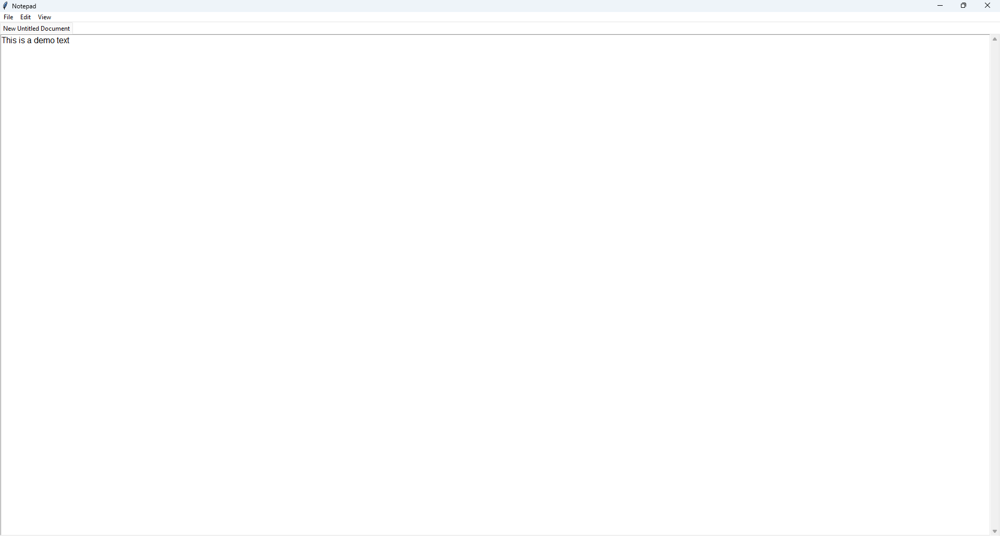
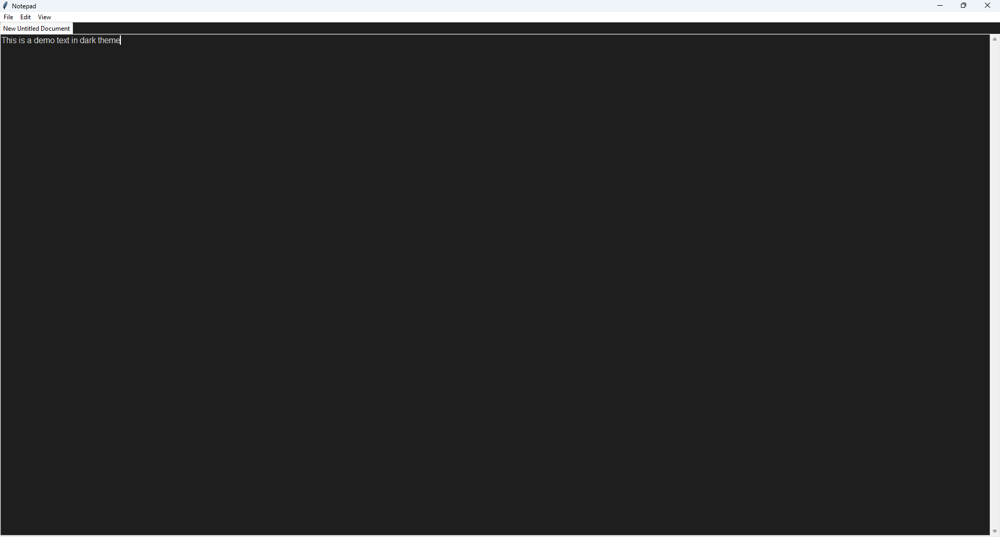
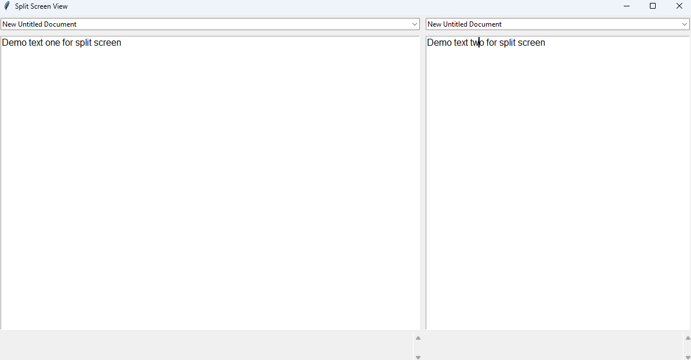
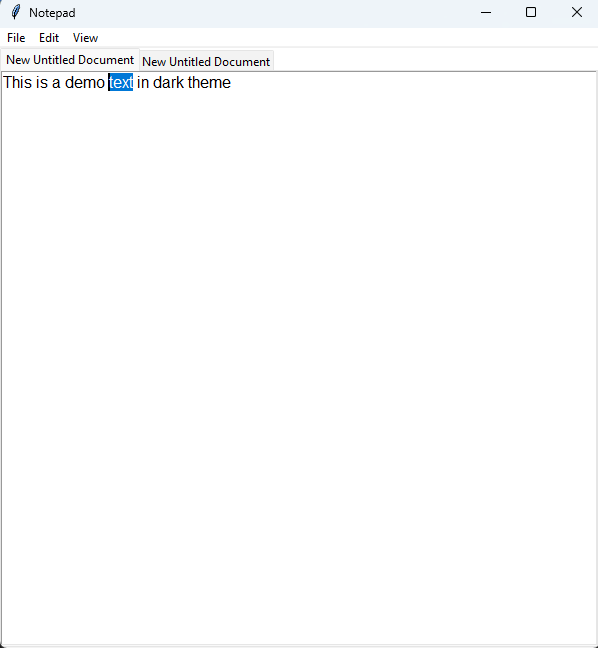
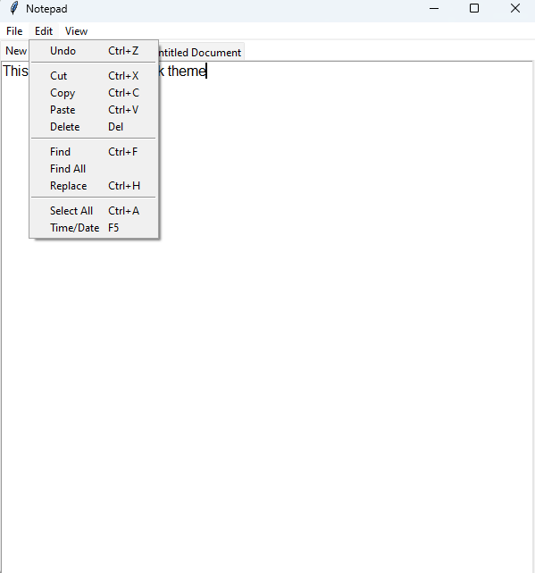

# Advanced Notepad

A feature-rich text editor built with Python and Tkinter, offering modern editing capabilities and a user-friendly interface.

## Features

- **Multi-tab Support**: Work on multiple files simultaneously with tabbed interface
- **Themes**: Switch between light and dark themes for comfortable editing
- **Syntax Highlighting**: Automatic syntax highlighting for various programming languages
- **Line Numbers**: Toggle line numbers for better code navigation
- **Auto-Save**: Automatic file saving at regular intervals (every 5 minutes)
- **Split Screen**: Split editor view for comparing or referencing files
- **Multiple Export Formats**: Save files as:
  - Text files (.txt)
  - PDF documents
  - Batch files (.bat)
  - Command prompt files (.cmd)

### Advanced Features
- **Find and Replace**: Powerful search functionality with find all option
- **Text Operations**: Cut, copy, paste, undo, and select all
- **Time/Date Insertion**: Quick insertion of current time and date
- **Context Menu**: Right-click menu for quick access to common operations
- **Tab Management**: Rename and close tabs as needed

## Dependencies

The application requires the following Python packages:
```
reportlab==4.0.4
pygments==2.15.1
```

## Installation

1. Clone this repository:
```bash
git clone https://github.com/yourusername/Advanced-Notepad.git
```

2. Install the required dependencies:
```bash
pip install -r requirements.txt
```

3. Run the application:
```bash
python notepad.py
```

## Configuration

The application settings are stored in `notepad_config.json` and include:
- Theme preference (light/dark)
- Line numbers visibility
- Auto-save status

These settings are automatically saved and loaded between sessions.

## Building from Source

The repository includes spec files for PyInstaller, allowing you to build a standalone executable:
```bash
pyinstaller Advanced_Notepad.spec
```

## Contributing

Feel free to fork this repository and submit pull requests for any improvements you'd like to add. Please ensure your code follows the existing style for consistency.

## License

This project is open source and available under the MIT License.

## Screenshots

### Main Interface
The main interface features a clean, modern design with tabbed editing and intuitive controls.


### Dark Theme
Switch to dark theme for comfortable coding in low-light environments.


### Split Screen
Compare or reference multiple files side by side with the split screen feature.


### Syntax Highlighting
Automatic syntax highlighting for various programming languages enhances code readability.


### Context Menu
Quick access to common operations through a right-click context menu.

